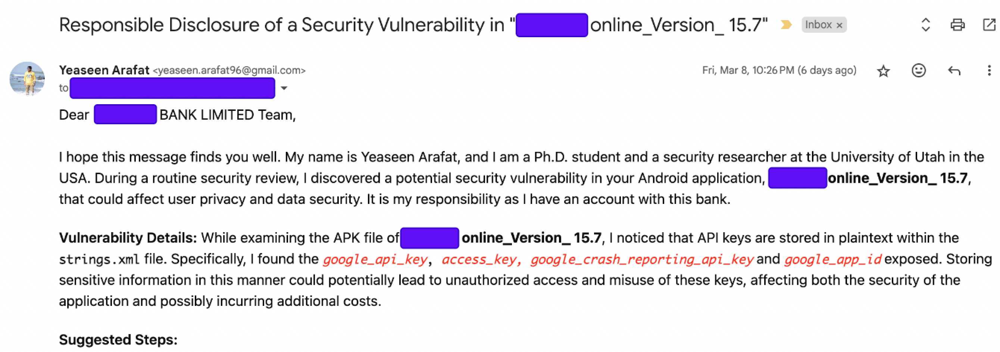

# vuln_discovery_0

# Responsible Vulnerability Disclosure Documentation

This repository documents the process of responsibly disclosing a security vulnerability discovered in an Android app of a famous bank in Bangladesh. The name is mutually undisclosed as it's a financial organization and the authority agreed to this. It aims to outline the steps taken to identify, verify, and report the vulnerability to the appropriate parties without exposing sensitive information or compromising the security of the bank's systems and its customers.

## Discovery Process

The vulnerability was discovered during a routine security review of publicly available banking applications.

## Reporting Process

1. **Identification of Reporting Channels**: The report was done to the CEO, CTO and the Security team.
2. **Preparation of the Report**: What sensetive keys I found and how it impacts the users' privacy
3. **Submission of the Report**: An official mail was sent.
4. **Follow-Up**: The initial response was prompt and from the CEO himself.

## Communication Log

- **First Submission Date**: Fri, Mar 8, 2024

  

- **Acknowledgment Received**: Yes. Fri, Mar 9, 2024
- **Subsequent Communication**:

## Conclusion

Responsible vulnerability disclosure is crucial in the collaborative effort to secure digital assets and protect users. This documentation aims to contribute to the broader community's understanding and practice of ethical vulnerability research and reporting.
